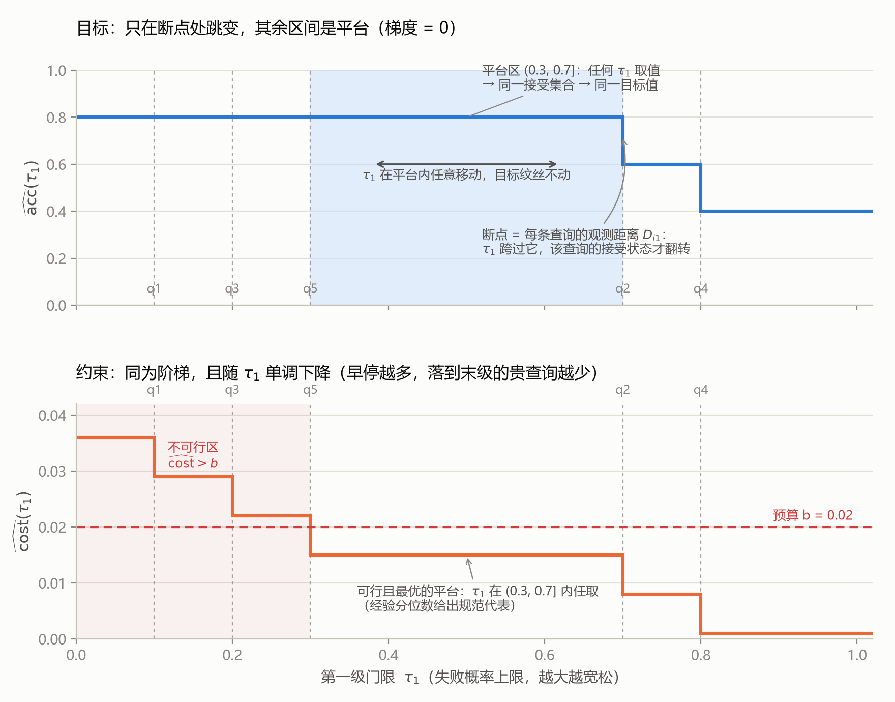

# Q4：为什么说目标对 τ 是"阶梯函数"（分段常数）？"没有梯度"意味着什么？

> **状态**：已解决（可继续追问）
> **日期**：2026-09-13
> **关联**：[总览笔记](../LLM_cascade_optimizer_notes.md) §1 难点3 / §4 · [Q1](Q1_tau3_fallback.md)（等价类） · [Q2](Q2_expectation_closed_form.md)（样本平均） · [Q3](Q3_mip_solver.md)（为什么不用梯度型/MIP 求解器）

---

## 问题原文

> 阶梯函数：固定 L 后，目标对 τ 分段常数——每条查询的接受/拒绝只在 τⱼ 跨过其观测距离 D_ij 时翻转，没有梯度。——这一个做详细说明解释？如果可能的话绘制图说明。

---

## 结论（TL;DR）

固定 $\mathbf{L}$ 后，目标 $\widehat{\mathrm{acc}}(\boldsymbol\tau)$ 对每一级门限 $\tau_j$ 都只通过 $n$ 个**指示函数** $\mathbf{1}\{D_{ij} < \tau_j\}$ 产生依赖，而单个指示函数就是最简单的阶梯（$\tau_j < D_{ij}$ 时 0，跨过后 1）。有限个阶梯的和仍是阶梯：**目标只在有限个断点处跳变，断点之间的区间上严格恒定**，断点集合就是观测距离的取值集合 $\{D_{ij}\}$。

后果有二：

1. **梯度失效**：导数几乎处处为 0（平台区），断点处不存在——而且**平台 ≠ 最优**，零梯度不携带任何"往哪走更好"的信息，一切梯度类优化器（GD/SGD/拟牛顿/L-BFGS）在此无用武之地；
2. **问题离散化**：τ 的连续搜索坍缩为"在有限个断点组合中挑最好"——这正是代码改用 **quantile 坐标（枚举断点）+ 粗网格 + Nelder-Mead（无梯度单纯形）** 的根本原因。

---

## 详细分析

### 1. 三步推导：阶梯性从定义直接掉出来

**第 1 步：目标对 τ 的全部依赖都藏在指示函数里。** 由总览笔记式 (2)：

$$
\widehat{\mathrm{acc}}(\boldsymbol\tau) = \frac{1}{n}\sum_{i=1}^{n}\sum_{j=1}^{m} A_{ij}(\boldsymbol\tau)\, R_{ij},
\qquad
A_{ij}(\boldsymbol\tau) = \tilde A_{ij}\cdot\mathbf{1}\{j = z_i\},
\qquad
\tilde A_{ij} = \mathbf{1}\{D_{ij} < \tau_j\}
$$

$R, C, D$ 都是固定常数矩阵（样本已缓存）。$\boldsymbol\tau$ 只出现在指示函数 $\mathbf{1}\{D_{ij} < \tau_j\}$ 的比较里。

**第 2 步：单个指示函数是最简单的阶梯。** 对固定的一对 $(i,j)$，把 $\tau_j$ 当自变量（其他 $\tau$ 固定）：

$$
\tau_j \mapsto \mathbf{1}\{D_{ij} < \tau_j\}
=
\begin{cases} 0, & \tau_j \le D_{ij} \\ 1, & \tau_j > D_{ij} \end{cases}
$$

在 $\tau_j = D_{ij}$ 处跳一次，其余处处常数。导数几乎处处为 0，跳点处不存在。

**第 3 步：有限和保持阶梯性。** 目标是 $n \times m$ 个这种阶梯的**加权和**（权重 $R_{ij}/n$）。有限个阶梯函数的和仍为阶梯函数，其断点集合是各分量断点集合的并集：

$$
\mathrm{Breakpoints}(\widehat{\mathrm{acc}}) \subseteq \{\, D_{ij} \;:\; i \in [n],\ j < m \,\}
$$

因此：**任意两个断点之间的开区间上，$\widehat{\mathrm{acc}}$ 严格恒定**。把 $\tau$ 从 0 扫到 1，目标值最多变化 $n(m-1)$ 次；对 $n=5,\ m=3$ 的例子，一条门限轴上最多 5 次跳变。成本约束 $\widehat{\mathrm{cost}}$ 同理（且例中随 $\tau_1$ 单调下降——接受越多，落到末级的贵查询越少）。

### 2. 图解



**读图指南**（数据 = 总览笔记 §6 的 5 条查询，单门限切片：固定只看 $\tau_1$，未被第一级接受的查询落到末级兜底；记号 $R,C,D,A$ 同总览笔记 §0 记号表）：

> ⚠️ **横轴方向**：$\tau_1$ 沿用代码的**失败概率**语义（$D = 1-g$，越大越**宽松**，右移 = 放宽）；
> 论文中作用在 $g$ 上的成功门限方向相反（$\tau^{\text{paper}} = 1 - \tau_1$，越大越**严格**）。
> 详见 [Q5](Q5_tau_semantics.md)。

- **上图（目标）**：蓝色阶梯是 $\widehat{\mathrm{acc}}(\tau_1)$。虚线 = 断点，每条对应一条查询的观测距离 $D_{i1}$（q1=0.1, q3=0.2, q5=0.3, q2=0.7, q4=0.8）。$\tau_1$ 在 $(0.3, 0.7]$ 内任意移动（蓝色阴影平台），接受集合 $\{1,3,5\}$ 不变 → 目标恒为 0.8；跨过 0.7 后 q2 被 A 接管（A 答错它）→ 跳水到 0.6；跨过 0.8 后 q4 也被接管 → 0.4。
- **下图（约束）**：橙色阶梯是 $\widehat{\mathrm{cost}}(\tau_1)$，随 $\tau_1$ 单调下降；红色虚线是预算 $b=0.02$。阴影左区 $\widehat{\mathrm{cost}}>b$ 不可行（罚 10000）。
- **两图合读**：可行且最优的区域恰是平台 $(0.3, 0.7]$——**平台内所有 $\tau_1$ 是同一个解**（这正是 [Q1](Q1_tau3_fallback.md) 末级等价类的同款原理，也是"分位数给出规范代表"的由来：经验分位数从平台中挑一个规范点）。
- **推广到两级**：$(\tau_1, \tau_2)$ 联合空间被 $\{D_{i1}\} \times \{D_{i2}\}$ 的网格线切成有限个"单元格"，每个单元格内目标恒定——单元格就是"划分等价类"，quantile 网格搜索枚举的正是这些单元格。

### 3. "没有梯度"的三个具体后果

1. **梯度类算法失效**。梯度下降需要 $\nabla_{\tau}\widehat{\mathrm{acc}}$ 指出"往哪走目标变好"；这里导数在平台内为 0、在断点处不存在。最要命的是：**平台 ≠ 极值点**——梯度为 0 的地方可能离最优很远（例中 $(0.1, 0.3]$ 平台值 0.8 与 $(0.7, 0.8]$ 平台值 0.6 的梯度都是 0），零梯度完全不携带方向信息。GD/SGD/拟牛顿/L-BFGS 全部失格。
2. **问题本质离散化**。既然目标只在断点组合处改变，连续优化就坍缩为组合选择：最优解必然存在于某个"单元格"中，而单元格数量有限（每级至多 $n$ 个断点）。要找最优，本质上只需在对的单元格里落一脚。
3. **算法选型的直接依据**。代码的三件套全是围绕阶梯性设计的：
   - **quantile 参数化**：经验分位数逐一落到断点上 → 每个格点对应一个不同的单元格，**不在同一平台内浪费评估**（论文 "interpolating the objective within a few samples" 的实质）；
   - **网格搜索**（`scipy.optimize.brute`）：在单元格集合上全局扫；
   - **Nelder-Mead**（`finish=fmin`）：无梯度单纯形，靠顶点比较而非导数，能在平台间小步移动——即便如此它仍可能停留在非最优平台上，这就是网格必须先行的原因。

---

## 代码证据

### 证据 1：目标求值就是"指示矩阵 + 有限和"（`optimizer.py:64-84`）

```python
def f(delta):
    e_full = (d_mat < delta)          # ã：n×m 个指示函数 1{D_ij < τ_j}，一次性算出
    for i in ...:                     # 首站停修正 → A（每行至多一个 1）
        ...
    acc  = numpy.sum(numpy.multiply(e_full, L_mat))   # 有限和 → 阶梯函数的一个值
    cost = numpy.sum(numpy.multiply(e_full, C_mat))
```

`(d_mat < delta)` 中的 `<` 就是阶梯的跳变判定；除这一处比较外，$\boldsymbol\tau$ 与目标再无其他耦合——阶梯性在代码结构上直接可见。

### 证据 2：算法选型是对阶梯性的回应（`optimizer.py:118-131`）

```python
qual_ranges = [(1e-5, 1-1e-5)] * (L_mat.shape[1]-1)
resbrute = scipy.optimize.brute(g, qual_ranges, full_output=True,
                                finish=scipy.optimize.fmin, Ns=40)
```

没有 `scipy.optimize.minimize(method='BFGS'/'L-BFGS-B')`（梯度法）——因为在阶梯函数上它们的解析梯度恒为 0、数值梯度恒为 0 或剧烈震荡，都不可用；取而代之的是网格（枚举单元格）+ 无梯度单纯形。

---

## 论文证据

- **`main.tex:159`**："we develop a specialized optimizer that (i) prunes the search space of L … and (ii) **approximates the objective by interpolating it within a few samples**."
  —— 阶梯性正是"少量采样即可刻画目标"的理论依据：目标的所有信息都集中在有限个断点上，只需采样断点（经验分位数），无需稠密采样或梯度。
- 论文没有展开阶梯性的论证（一笔带过为 "inherently a mixed-integer optimization"，见 [Q3](Q3_mip_solver.md)）；本节的推导是对该措辞的补全。

---

## 公式与数学推理

**命题**（阶梯性）：固定 $\mathbf{L}$ 与样本 $\{D_{ij}\}$，则 $\widehat{\mathrm{acc}}(\boldsymbol\tau)$ 与 $\widehat{\mathrm{cost}}(\boldsymbol\tau)$ 是 $\boldsymbol\tau$ 的分段常数函数，断点集 $\subseteq \{D_{ij}: i\in[n],\ j<m\}$。

**证明**：对每对 $(i,j)$，$\tau \mapsto \mathbf{1}\{D_{ij} < \tau_j\}$ 关于 $\tau_j$ 单调右连续，仅在 $\tau_j = D_{ij}$ 处不连续，其余点处局部常数。取
$$U = \mathbb{R}^{m-1} \setminus \bigcup_{i,j} \{\boldsymbol\tau : \tau_j = D_{ij}\}$$
$U$ 是有限条超平面的补集，由有限个开单元格组成。在每个单元格内所有指示函数同时局部常数 → 它们的加权和（即 $\widehat{\mathrm{acc}}, \widehat{\mathrm{cost}}$）在该单元格上恒定。$\blacksquare$

**推论 1**（值域有限）：$\widehat{\mathrm{acc}}$ 的取值至多 $n(m-1) + 1$ 个（沿任意一条线扫过时）。
**推论 2**（平台 = 等价类）：同一单元格内任意两点 $\boldsymbol\tau', \boldsymbol\tau''$ 产生相同的接受划分，目标与约束完全相同——这是 [Q1](Q1_tau3_fallback.md) 中"末级门限等价类"的全门限版。
**推论 3**（梯度）：在 $U$ 内 $\nabla\widehat{\mathrm{acc}} \equiv \mathbf{0}$；在断点超平面上梯度不存在。且 $\nabla = \mathbf{0} \not\Rightarrow$ 最优（非退化平台的测度为正时，梯度法停在任何初值所在的平台）。

---

## 边界情况与注意点

- **并列断点**：多条查询的 $D_{ij}$ 相同（如打分器输出聚集）时断点合并，单元格更少——quantile 网格自动去重；
- **噪声注入**：`score_noise_injection`（`llmcascade.py:136`）给 score 加微小随机数，会轻微扰动断点位置，把贴得很近的断点抖开，但不改变阶梯性本身；
- **Nelder-Mead 的平台游走**：单纯形在常数平台上可能长时间无进展（顶点值全相同），因此网格先行的顺序不能颠倒——先定位到含最优单元格的平台，再让 fmin 微调；
- **严格不等号**：接受条件是严格小于 $D_{ij} < \tau_j$，在 $\tau_j$ 恰等于断点时查询**不被**接受；图上把跳变画在断点处是测度零的理想化，不影响任何结论。

---

## 总结

阶梯性不是近似，是目标函数的**精确结构**：$\boldsymbol\tau$ 只通过 $n(m-1)$ 个比较指示符进入目标，每个指示符是单跳阶梯，有限和保持阶梯——目标被 $\{D_{ij}\}$ 的超平面切成有限个常数单元格。由此，"连续优化"名存实亡：梯度处处为零或不存在（且零梯度 ≠ 最优），算法必须改为"枚举单元格"——这正是 quantile 坐标网格（枚举断点）+ Nelder-Mead（无梯度精修）的组合逻辑，也是论文"用少量样本插值目标"一语的数学内核。

---

## 可能的追问方向

- quantile 断点枚举的严格版：为什么经验分位数生成的候选恰好覆盖所有单元格
- Nelder-Mead 单纯形在阶梯目标上的具体行为（平台停滞、步长自适应）
- `scipy.optimize.brute` 的网格密度 $N_s$ 怎么选才能不漏最优单元格
- 二维单元格划分 $(\tau_1,\tau_2)$ 的可视化
